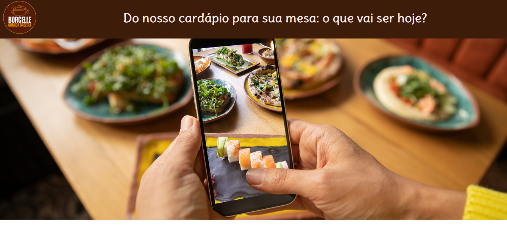

<h1 align="center"> 🍲 Bem-vindo ao Seu Restaurante Favorito! ❤️🍴 </h1>

🚀 Self-Service: Você no Controle! ⚡🖐️

  <a href="#-tecnologias">Tecnologias</a>&nbsp;&nbsp;&nbsp;|&nbsp;&nbsp;&nbsp;
  <a href="#-projeto">Projeto</a>&nbsp;&nbsp;&nbsp;|&nbsp;&nbsp;&nbsp;
  

  

 

  

## 🚀 Tecnologias

Esse projeto foi desenvolvido com as seguintes tecnologias:

- HTML e CSS
- javascript
- Git e Github

## 💻 Projeto

🍽️ Explore nosso Restaurante Virtual! 🖼️✨ O cardápio ganha vida com imagens que mudam a cada 2 segundos, tornando sua experiência mais interativa e deliciosa! 😋

## 🔖 Licença

Esse projeto está sob a licença MIT....